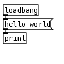

# PdPy

A python package to interact with Pure Data (Pd) from Python.

Translate Pure Data files from the `.pd` format to other formats such as [JSON](https://www.json.org/json-en.html) and [Pickle](https://docs.python.org/3/library/pickle.html#module-pickle), or [XML](https://www.w3.org/standards/xml).

## Example

Translate a Pure Data patch into a JSON-formatted file. See [translate.py](src/translate.py).

The code to run is:

``` bash
python3 translate.py -t json -f pd -i tests/hello-world.pd -o tests/hello-world.json 
```

The original file looks like this:

```c
#N canvas 47 51 450 300 12;
#X obj 37 37 loadbang;
#X msg 37 61 hello world;
#X obj 37 85 print;
#X connect 0 0 1 0;
#X connect 1 0 2 0;
```



The result is something like this in JSON:

```json
{
    "patchname": "hello-world.pd",
    "encoding": "utf-8",
    "__pdpy__": "PdPy",
    "root": {
        "__pdpy__": "Canvas",
        "isroot": true,
        "name": "hello-world.pd",
        "vis": 1,
        "screen": {
            "__pdpy__": "Point",
            "x": 47,
            "y": 51
        },
        "dimension": {
            "__pdpy__": "Size",
            "width": 450,
            "height": 300
        },
        "font": 12,
        "nodes": [
            {
                "__pdpy__": "PdObject",
                "id": 0,
                "position": {
                    "__pdpy__": "Point",
                    "x": 37,
                    "y": 37
                },
                "className": "loadbang"
            },
            {
                "__pdpy__": "PdMessage",
                "id": 1,
                "position": {
                    "__pdpy__": "Point",
                    "x": 37,
                    "y": 61
                },
                "className": "msg",
                "targets": [
                    {
                        "__pdpy__": "PdMsg",
                        "address": "outlet",
                        "message": [
                            "hello world"
                        ]
                    }
                ]
            },
            {
                "__pdpy__": "PdObject",
                "id": 2,
                "position": {
                    "__pdpy__": "Point",
                    "x": 37,
                    "y": 85
                },
                "className": "print"
            }
        ],
        "edges": [
            {
                "__pdpy__": "Edge",
                "source": {
                    "__pdpy__": "Source",
                    "id": "0",
                    "port": "0"
                },
                "sink": {
                    "__pdpy__": "Source",
                    "id": "1",
                    "port": "0"
                }
            },
            {
                "__pdpy__": "Edge",
                "source": {
                    "__pdpy__": "Source",
                    "id": "1",
                    "port": "0"
                },
                "sink": {
                    "__pdpy__": "Source",
                    "id": "2",
                    "port": "0"
                }
            }
        ]
    }
}
```

...or run this to get XML:

``` bash
python3 translate.py -t json -f pd -i tests/hello-world.pd -o tests/hello-world.json 
```

```xml
<pdpy encoding="utf-8">
    <root pdpy="Canvas">
        <font>12</font>
        <name>hello-world.pd</name>
        <vis>1</vis>
        <isroot>True</isroot>
        <screen pdpy="Point">
            <x>47</x>
            <y>51</y>
        </screen>
        <dimension pdpy="Size">
            <width>450</width>
            <height>300</height>
        </dimension>
        <nodes>
            <loadbang pdpy="PdObject">
                <id>0</id>
                <position pdpy="Point">
                    <x>37</x>
                    <y>37</y>
                </position>
                <className>loadbang</className>
            </loadbang>
            <pdmessage>
                <id>1</id>
                <position pdpy="Point">
                    <x>37</x>
                    <y>61</y>
                </position>
                <pdmsg>
                    <address>outlet</address>
                    <message>hello world</message>
                </pdmsg>
            </pdmessage>
            <print pdpy="PdObject">
                <id>2</id>
                <position pdpy="Point">
                    <x>37</x>
                    <y>85</y>
                </position>
                <className>print</className>
            </print>
        </nodes>
        <edges>
            <edge>
                <source pdpy="Source">
                    <id>0</id>
                    <port>0</port>
                </source>
                <sink pdpy="Source">
                    <id>1</id>
                    <port>0</port>
                </sink>
            </edge>
            <edge>
                <source pdpy="Source">
                    <id>1</id>
                    <port>0</port>
                </source>
                <sink pdpy="Source">
                    <id>2</id>
                    <port>0</port>
                </sink>
            </edge>
        </edges>
    </root>
</pdpy>
```

## References

Pure Data to XML:
<https://lists.puredata.info/pipermail/pd-dev/2004-12/003316.html>

Pure Data to JSON:
<https://lists.puredata.info/pipermail/pd-dev/2012-06/018434.html>

new file format :
<https://lists.puredata.info/pipermail/pd-dev/2007-09/009483.html>

PURE DATA FILE FORMAT
<http://puredata.info/docs/developer/PdFileFormat>

sebpiq's web pd project:
<https://github.com/sebpiq/WebPd_pd-parser>
<https://github.com/sebpiq/pd-fileutils>
